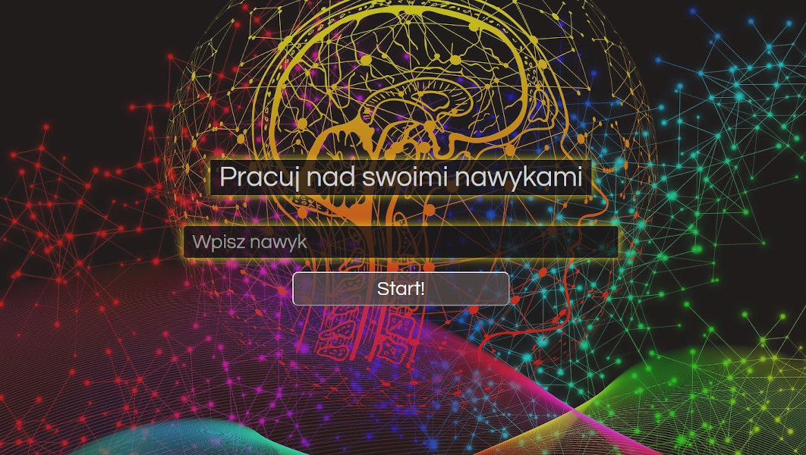
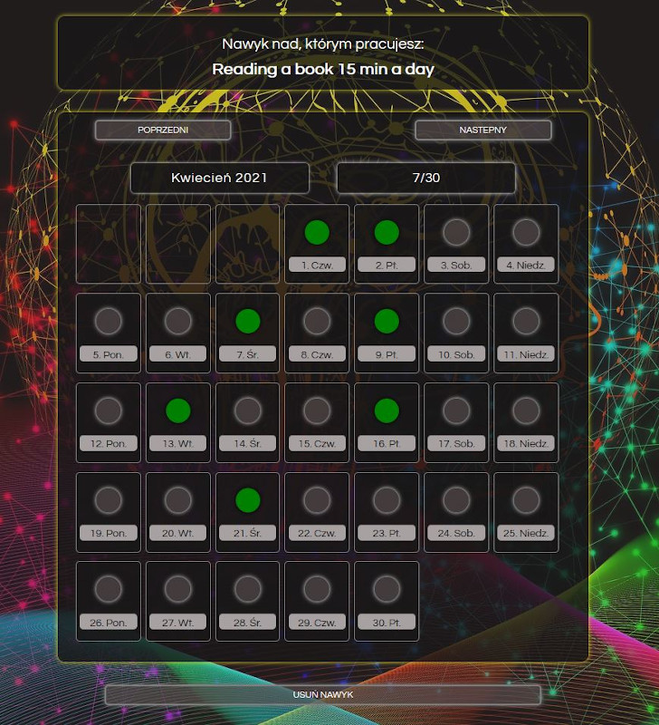

# Habit Controller

## Introduction

Habit Controller is a calendar where you can mark your progress in habbit you are working on. To start
tracking you progress just enter the habbit you want to work on:

Then you check day if you succeed :

The data is stored in LocalStorage.!

## Technologies

- JavaScript,
- SCSS,
- LocalStorage

## Setup

No bundler/ no dependencies were used so please download locally project and open it with local server (e.g Live Server extenssion in your code editor). The preview is also available by github pages [here](https://mtkuchta.github.io/kontrolerNawykow/).
